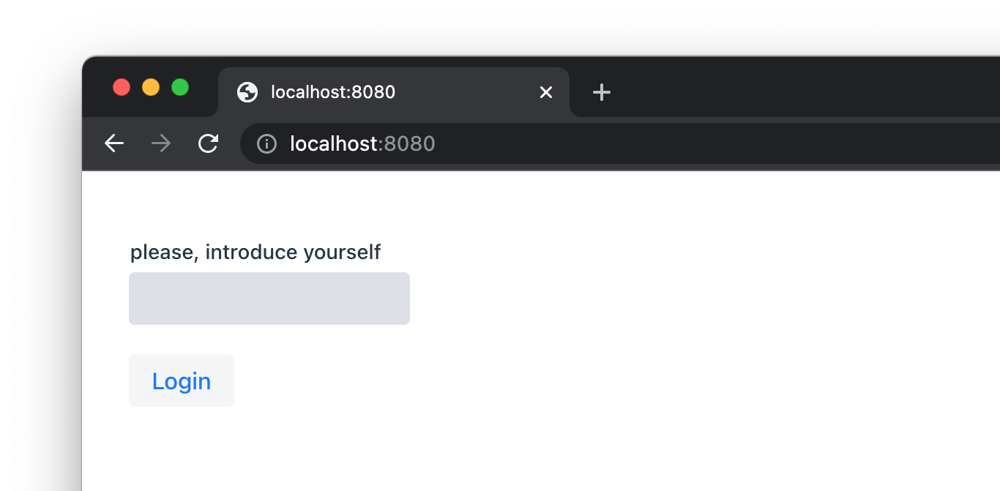
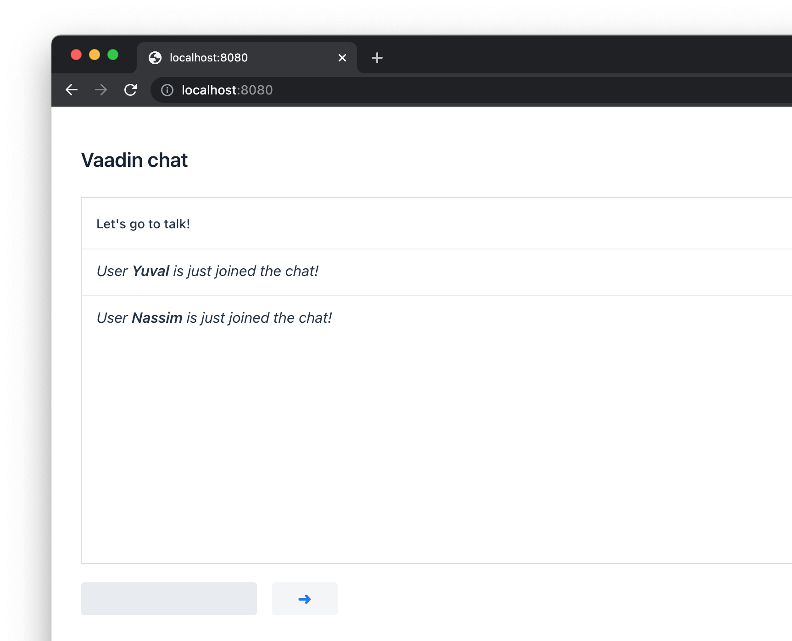
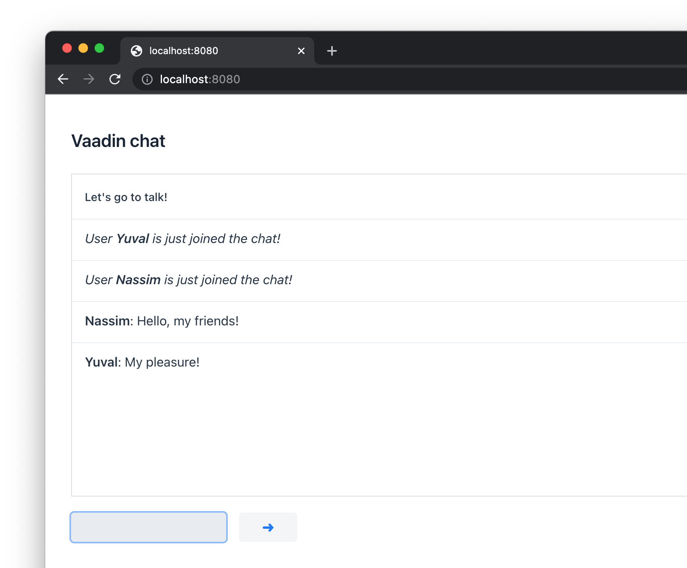

# Vaadin simple user messge chat

Project was created according to the crash lesson ["Web чат на чистой Java (Vaadin) - The web chat on pure Java (Vaadin)"](https://www.youtube.com/watch?v=o07DfTMs2N4) by "letsCode" youtube channel.

### Dependencies:
* SpringBoot
* Lombok
* Vaadin
* Txtmark - Java markdown processor https://github.com/rjeschke/txtmark

### Screenshots:
1. User login

2. Users are joined the chat

3. Users are write the messages

